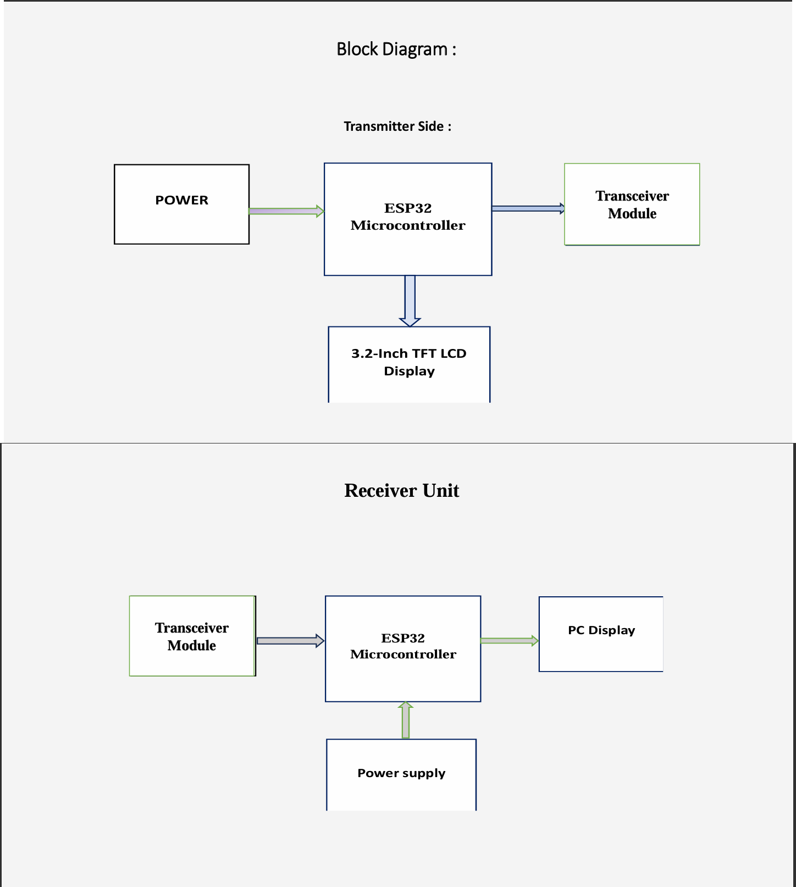
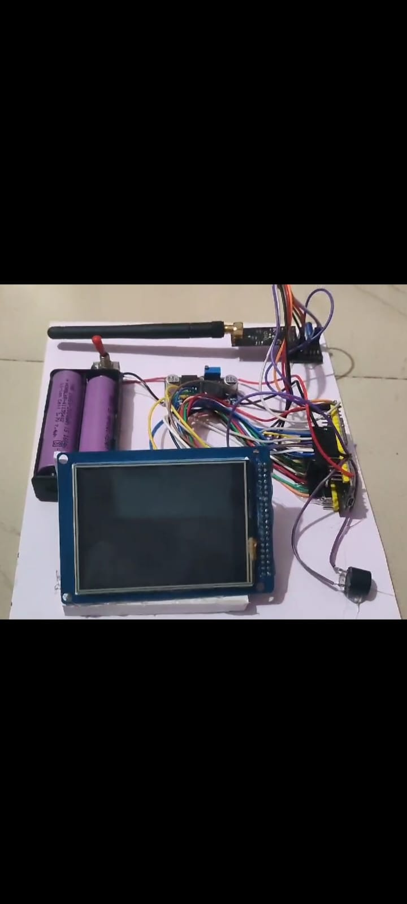
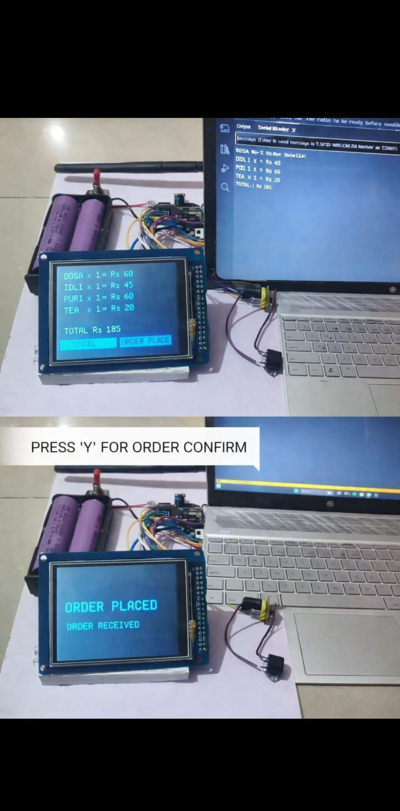

# Wireless Two-Way Food Ordering System using ESP32 and nRF24L01

## Overview
This project implements a wireless food ordering system using ESP32 microcontrollers and nRF24L01 RF transceiver modules. The system allows customers to place food orders from their table using a digital interface, which are then transmitted wirelessly to the kitchen unit.

The system supports two-way communication, allowing the kitchen to acknowledge received orders and update the order status.

---

## System Architecture

Customer Unit (Transmitter)
ESP32 → SPI → nRF24L01 → Wireless RF Signal

Kitchen Unit (Receiver)
nRF24L01 → SPI → ESP32 → Display Order

---

## Hardware Components
- ESP32 Microcontroller
- nRF24L01 + PA + LNA RF Module
- 3.2 Inch TFT LCD Display
- LM2596 Buck Converter
- Lithium Ion Battery
- Buzzer
- Push Buttons

---

## Communication Protocol
The ESP32 communicates with the nRF24L01 RF module using the **SPI protocol**.

The nRF24L01 modules transmit data wirelessly using **2.4 GHz RF communication**, enabling reliable short-range wireless communication between the customer unit and kitchen unit.

---

## Features
- Wireless food ordering
- Two-way communication
- Real-time order acknowledgement
- Digital e-menu interface
- Reduced order errors
- Faster service in restaurants

---

## Project Structure


```

esp32-wireless-food-ordering-system
│
├── transmitter
│   └── transmitter.ino
│
├── receiver
│   └── receiver.ino
│
├── documentation
│   └── project_presentation.pdf
│
├── images
│   ├── block_diagram.png
│   ├── hardware_setup.jpeg
│   └── output_demo.jpeg
│
└── README.md
```
## 📸 Project Images

### 🔹 System Block Diagram


### 🔹 Hardware Setup


### 🔹 Output

---
## 🎥 Demo Video

Watch the working demo of the ESP32 Wireless Food Ordering System:

👉 https://youtu.be/1d4zGYsafx8

## Applications
- Restaurants
- Smart cafeterias
- Self-service food ordering systems
- Smart hospitality systems

---

## Future Improvements
- Mobile app integration
- Cloud based order management
- Payment integration
- Order tracking system

---

## Project Team
- Gagan Bhairamatti
- Amanullakhan J Pathan
- Basavaraj Bajantri
- Prajwal Desai

---
Developed by: Gagan Bhairamatti
